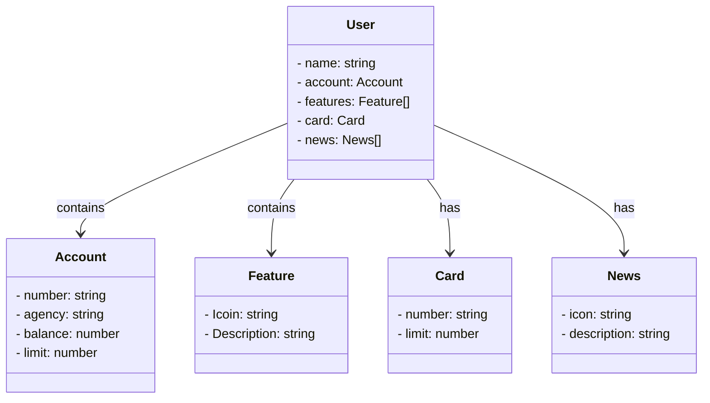

# edu.cfarias.cfariaslab

##Diagrama de Classe
*************************************************************

```mermaid
classDiagram
  class User {
    - name: string
    - account: Account
    - features: Feature[]
    - card: Card
    - news: News[]
  }

  class Account {
    - number: string
    - agency: string
    - balance: number
    - limit: number
  }

  class Feature {
    - Icoin: string
    - Description: string
  }

  class Card {
    - number: string
    - limit: number
  }

  class News {
    - icon: string
    - description: string
  }

  User --> Account : contains
  User --> Feature : contains
  User --> Card : has
  User --> News : has

```
*************************************************************
